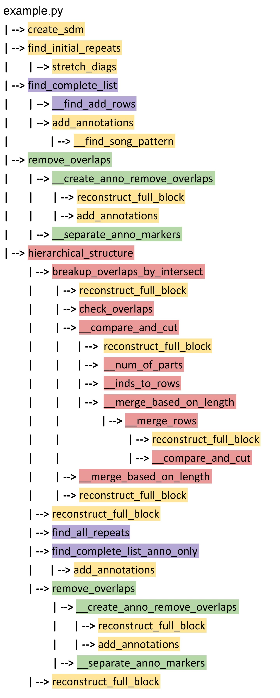

Function Pipeline
=================

Before we dive deep into the implementation of the package via the walk-through of a complete example,
a function pipeline is shown below to illustrate the function calls in each step. For an in-depth look 
at each function, check the corresponding Jupyter Notebooks for each module.

* Yellow:  `Utilities <https://github.com/smith-tinkerlab/repytah/blob/main/docs/utilities_vignette.ipynb>`_
* Purple `Search <https://github.com/smith-tinkerlab/repytah/blob/main/docs/search_vignette.ipynb>`_
* Green: `Transform <https://github.com/smith-tinkerlab/repytah/blob/main/docs/transform_vignette.ipynb>`_
* Red: `Assemble <https://github.com/smith-tinkerlab/repytah/blob/main/docs/assemble_vignette.ipynb>`_

